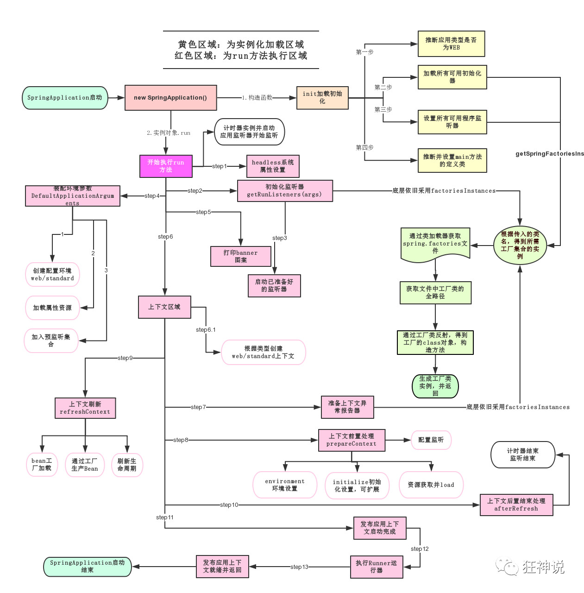

# 微服务阶段

Java SE：OOP

MySQL：持久化

HTML+CSS+js+jquery+框架：视图。框架不熟练，css不好；

JavaWeb：独立开发MVC三层架构的网站了：原始

ssm：框架，简化了我们的开发流程，配置也开始较为复杂；

**war：tomcat运行**

Spring再简化：SpringBoot；微服务架构！


http://xxxx.do


新服务架构：服务网格


老师：

- 培训讲师
  - 面向面试培训，教你如何使用，快速上手！

- 做教育的
  - 如何学习新东西，如何持续学习，如何关注这个行业！
  - 来龙去脉，历史，理论；谈资

30岁：经理

30岁：程序猿：淘汰！


maven、spring、springmvc、springboot、……docker、k8s：约定大于配置


程序 = 数据结构 + 算法（集合框架）；=>程序员

程序 = 面向对象 + 框架；=>码农


MVC三层架构 MVVM 微服务架构


业务： service：userService: ===>模块！


springmvc，controller==>提供接口！


http：rpc


用户下单：controller！1s


消息队列：


仓库冻结：资金冻结；验证：购买成功，仓库数量减少，仓库解冻，资金解冻 10s


高内聚，低耦合！


8k-13k

软实力：聊天+举止+谈吐+见解

你主导面试官 13k：聊天

面试官主导你 8k


# 第一个SpringBoot程序

- jdk 1.8
- maven 3.6.1
- springboot：最新版
- IDEA

官方：提供了一个快速生成的项目

# 原理初探

自动配置：

pom.xml

- spring-boot-dependencies：核心依赖在父工程中
- 我们在写或者引入一些SpringBoot依赖的时候，不需要指定版本，就因为有这些版本仓库


启动器

- ~~~xml
  <dependency>
  	<groupId>org.springframework.boot</groupId>
      <artifactId>spring-boot-starter</artifactId>
  </dependency>
  ~~~

- 启动器：说白了就是SpringBoot的启动场景；

- 比如spring-boot-starter-web，他就会帮我们自动导入web环境所有的依赖！

- SpringBoot会将所有的功能场景，都变成一个个的启动器

- 我们要使用什么功能，就只需要找到对应的启动器就可以了`starter`

**主程序**

~~~java
//@SpringBootApplication：标注这个类是一个springboot的应用
@SpringBootApplication
public class Springboot01HelloworldApplication {
    
    public static void main(String[] args){
        //将springboot应用启动
        //该方法返回一个ConfigurableApplicationContext对象
        //参数一：应用入口的类	参数类：命令行参数
        SpringAplication.run(Springboot01HelloworldApplication.class, args);
    }
    
}
~~~

- 注解

  - ~~~java
    @SpringBootConfiguration：springboot的配置
        @Configuration：spring配置类
        @Component：说明这也是一个spring的组件
        
    @EnableAutoConfiguration：自动配置
        @AutoConfigurationPackage：自动配置包
        	@Import（AutoConfigurationImportSelector.class)：自动配置`包注册`
                @Import(AutoConfigurationImportSelector.class)：自动配置导入选择
    
    //获取所有的配置
    List<String> configurations = getCandidateConfigurations(annotationMetadata,attributes);
    ~~~

获取候选的配置

~~~java
protected List<String> getCandidateConfigurations(AnnotationMetadata metadata,AnnotationAttributes attributes){
	List<String> configurations = SpringFactoriesLoader.loadFactoryNames(getSpringFactoriesLoaderFactoryClass(),getBeanClassLoader());
    Assert.notEmpty(configurations,"No auto configuration classes found in META-INF/spring.factories.If you " + "are using a custom packaging,make sure that file is correct.");
    return configurations;
}
~~~

META-INF/spring.factories：自动配置的核心文件


~~~java
Properties properties = PropertiesLoaderUtils.loadProperties(resource);
所有资源加载到配置类中！
~~~

**结论：springboot所有自动配置都是在启动的时候扫描并加载：**`spring.factories`**所有的自动配置类都在这里面，但是不一定生效，要判断条件是否成立，只要导入了对应的start，就有对应的启动器了，有了启动器，我们自动装配就会生效，然后就配置成功！**


>  **1、springboot在启动的时候，从类路径下/META-INF/spring.factories获取指定的值**
>
> **2、将这些自动配置的类导入容器，自动配置就会生效，帮我进行自动配置**
>
> **3、以前我们需要自动配置的东西，现在springboot帮我们做了**
>
> **4、整合javaEE，解决方案和自动配置的东西都在spring-boot-autoconfigure-2.x.x.RELEASE.jar这个包下**
>
> **5、它会把所有需要导入的组件，以类名的方式返回，这些组件就会被添加到容器**
>
> **6、容器中也会存在非常多的xxxAutoConfiguration的文件，就是这些类给容器中导入了这个场景需要的所有组件；并自动配置，@Configuration，JavaConfig！**
>
> **7、有了自动配置类，免去了我们手动编写配置文件的工作！**


JavaConfig：@Configuration    @Bean

Docker：进程


关于SpringBoot，谈谈你的理解

- 自动装配
- run()


全面接管SpringMVC的配置！实操！

> run方法流程分析



# SpringBoot配置

## **配置文件**

SpringBoot使用一个全局的配置文件，配置文件名称是固定的。

- application.properties
  - 语法结构： key=value
- appliction.yml
  - 语法结构：key：空格 value

**配置文件的作用：**修改SpringBoot自动配置的默认值，因为SpringBoot在底层都给我们自动配置好了；

## YAML

YAML是“YAML Ain‘t a Markup Language”（YAML不是一种置标语言）的递归缩写。

在开发的这种语言，YAML的意思其实是：“Yet Another Markup Language”（仍是一种置标语言）

YAML A Markup Language：是一个标记语言

YAML isnot Markup Language：不是一个标记语言

**yaml配置：**

~~~yml
server:
	port: 8080
~~~

**xml配置：**

~~~xml
<server>
	<port>8080</port>
</server>
~~~

**yaml可以直接给实体类赋值：**

实体类Person，代码如下：

~~~java
import org.springframework.stereotype.Component;

import java.util.Date;
import java.util.List;
import java.util.Map;

/*
@ConfigurationProperties作用：
将配置文件中配置的每一个属性的值，映射到这个组件中；
告诉SpringBoot将本类中的所有属性和配置文件中相关的配置进行绑定
参数 prefix = "person" : 将配置文件中的person下面的所有属性一一对应

只有这个组件是容器中的组件，才能使用容器提供的@ConfigurationProperties功能
*/
@Component
/*如果不配置使用了这个注解：就会提示爆红。可以通过这配置产生提示。prefix="person"暴露出来，这样好和yaml进行绑定*/
@ConfigurationProperties(prefix = "person")  
public class Person{
    private String name;
    private int age;
    private Boolean happy;
    private Date birth;
    private Map<String,Object> maps;
    private List<Object> lists;

    public Person(){}

    public Person(String name, Integer age, Boolean happy, Date birth, Map<String, Object> maps, List<Object> lists) {
        this.name = name;
        this.age = age;
        this.happy = happy;
        this.birth = birth;
        this.maps = maps;
        this.lists = lists;
    }

    public String getName() {
        return name;
    }

    public void setName(String name) {
        this.name = name;
    }

    public Integer getAge() {
        return age;
    }

    public void setAge(Integer age) {
        this.age = age;
    }

    public Boolean getHappy() {
        return happy;
    }

    public void setHappy(Boolean happy) {
        this.happy = happy;
    }

    public Date getBirth() {
        return birth;
    }

    public void setBirth(Date birth) {
        this.birth = birth;
    }

    public Map<String, Object> getMaps() {
        return maps;
    }

    public void setMaps(Map<String, Object> maps) {
        this.maps = maps;
    }

    public List<Object> getLists() {
        return lists;
    }

    public void setLists(List<Object> lists) {
        this.lists = lists;
    }

    @Override
    public String toString() {
        return "Person{" +
                "name='" + name + '\'' +
                ", age=" + age +
                ", happy=" + happy +
                ", birth=" + birth +
                ", maps=" + maps +
                ", lists=" + lists +
                '}';
    }
}
~~~

application.yaml如下：

~~~yml
person:
  name: qinjiang
  age: 3
  happy: false
  birth: 2019/11/02
  maps: {k1: v1,k2: v2}
  lists:
    - code
    - music
    - girl
~~~

写测试类如下，在idea中点击contextLoads方法左侧的绿色小箭头：

~~~java
package com.example.demo;

import com.example.demo.pojo.Person;
import org.junit.jupiter.api.Test;
import org.springframework.beans.factory.annotation.Autowired;
import org.springframework.boot.test.context.SpringBootTest;

@SpringBootTest
public class Test01 {
    @Autowired
    private Person person;

    @Test
    void contextLoads(){
        System.out.println(person);
    }
}
~~~

运行结果：

~~~console
  .   ____          _            __ _ _
 /\\ / ___'_ __ _ _(_)_ __  __ _ \ \ \ \
( ( )\___ | '_ | '_| | '_ \/ _` | \ \ \ \
 \\/  ___)| |_)| | | | | || (_| |  ) ) ) )
  '  |____| .__|_| |_|_| |_\__, | / / / /
 =========|_|==============|___/=/_/_/_/
 :: Spring Boot ::                (v2.5.4)

2021-09-15 18:49:36.039  INFO 3204 --- [           main] com.example.demo.Test01                  : Starting Test01 using Java 1.8.0_301 on DESKTOP-J86BLD1 with PID 3204 (started by Yi in D:\Codes\IntelliJ IDEA\demo)
2021-09-15 18:49:36.043  INFO 3204 --- [           main] com.example.demo.Test01                  : No active profile set, falling back to default profiles: default
2021-09-15 18:49:38.319  INFO 3204 --- [           main] com.example.demo.Test01                  : Started Test01 in 2.803 seconds (JVM running for 5.251)
Person{name='qinjiang', age=3, happy=false, birth=Sat Nov 02 00:00:00 CST 2019, maps={k1=v1, k2=v2}, lists=[code, music, girl]}

Process finished with exit code 0
~~~

> 显示出Person{name='qinjiang', age=3, happy=false, birth=Sat Nov 02 00:00:00 CST 2019, maps={k1=v1, k2=v2}, lists=[code, music, girl]}，表示实体类与yaml绑定成功

## yaml文件位置优先级

①项目路径下的config文件夹配置文件 => 1

②项目路径下配置文件 => 2

③资源路径下的config文件夹配置文件 => 3

④资源路径下配置文件 => 4

> 优先级：① **>** ② **>** ③ **>** ④

**注意：**系统创建默认选择最低优先级位置。


## Spring应用中yaml多环境切换

```yaml
server:
 port: 8081
spring:
 profiles:
  active: dev  # 切换控制点
  
---
server:
 port: 8082
spring:
 profiles: dev #切换可选项的值
 
---
server:
 port: 8083
spring:
 profiles: test #切换可选项的值
```

## 自动装配的原理——精髓

1、SpringBoot启动会加载大量的自动配置类

2、我们看我们需要的功能有没有在SpringBoot默认写好的自动配置类当中；

3、我们再来看这个自动配置类中到底配置了哪些组件；（只要我们用的组件存在其中，我们就不需要在手动配置了）

4、给容器中自动配置类添加组件的时候，会从properties类中获取某些属性。我们只需要在配置文件中指定这些属性的值即可；

xxxxAutoConfigurartion：自动配置类；给容器中添加组件				

xxxxProperties：封装配置文件中相关属性；

> xxxxAutoConfigurartion=>xxxxProperties=>springboot配置   .yml


**那么多的自动配置类，必须在一定的条件下才能生效；也就是说，我们加载了这么多的配置类，但不是所有的都生效了。**

我们怎么知道哪些自动配置类生效；**我们可以通过启用debug=true属性；来让控制台打印自动配置报告，这样我们就可以很方便的知道哪些自动配置类生效；**

~~~xml
# 开启springboot的调试类
debug=true
~~~

Positive matches：（自动配置类启用的：正匹配）

Negative matches：（没有启动，没有匹配成功的自动配置类：负匹配）

Unconditional classes：（没有条件的类）

输出的日志我们可以在这里看下：

~~~xml
D:\SoftWare\Tools\environments\Java\jdk1.8.0_301\bin\java.exe -Dvisualvm.id=81338555833600 -XX:TieredStopAtLevel=1 -noverify -Dspring.output.ansi.enabled=always "-javaagent:D:\SoftWare\Tools\Jetbrains Softwares\IntelliJ IDEA 2021.2\lib\idea_rt.jar=12076:D:\SoftWare\Tools\Jetbrains Softwares\IntelliJ IDEA 2021.2\bin" -Dcom.sun.management.jmxremote -Dspring.jmx.enabled=true -Dspring.liveBeansView.mbeanDomain -Dspring.application.admin.enabled=true -Dfile.encoding=UTF-8 -classpath "D:\SoftWare\Tools\environments\Java\jdk1.8.0_301\jre\lib\charsets.jar;D:\SoftWare\Tools\environments\Java\jdk1.8.0_301\jre\lib\deploy.jar;D:\SoftWare\Tools\environments\Java\jdk1.8.0_301\jre\lib\ext\access-bridge-64.jar;D:\SoftWare\Tools\environments\Java\jdk1.8.0_301\jre\lib\ext\cldrdata.jar;D:\SoftWare\Tools\environments\Java\jdk1.8.0_301\jre\lib\ext\dnsns.jar;D:\SoftWare\Tools\environments\Java\jdk1.8.0_301\jre\lib\ext\jaccess.jar;D:\SoftWare\Tools\environments\Java\jdk1.8.0_301\jre\lib\ext\jfxrt.jar;D:\SoftWare\Tools\environments\Java\jdk1.8.0_301\jre\lib\ext\localedata.jar;D:\SoftWare\Tools\environments\Java\jdk1.8.0_301\jre\lib\ext\nashorn.jar;D:\SoftWare\Tools\environments\Java\jdk1.8.0_301\jre\lib\ext\sunec.jar;D:\SoftWare\Tools\environments\Java\jdk1.8.0_301\jre\lib\ext\sunjce_provider.jar;D:\SoftWare\Tools\environments\Java\jdk1.8.0_301\jre\lib\ext\sunmscapi.jar;D:\SoftWare\Tools\environments\Java\jdk1.8.0_301\jre\lib\ext\sunpkcs11.jar;D:\SoftWare\Tools\environments\Java\jdk1.8.0_301\jre\lib\ext\zipfs.jar;D:\SoftWare\Tools\environments\Java\jdk1.8.0_301\jre\lib\javaws.jar;D:\SoftWare\Tools\environments\Java\jdk1.8.0_301\jre\lib\jce.jar;D:\SoftWare\Tools\environments\Java\jdk1.8.0_301\jre\lib\jfr.jar;D:\SoftWare\Tools\environments\Java\jdk1.8.0_301\jre\lib\jfxswt.jar;D:\SoftWare\Tools\environments\Java\jdk1.8.0_301\jre\lib\jsse.jar;D:\SoftWare\Tools\environments\Java\jdk1.8.0_301\jre\lib\management-agent.jar;D:\SoftWare\Tools\environments\Java\jdk1.8.0_301\jre\lib\plugin.jar;D:\SoftWare\Tools\environments\Java\jdk1.8.0_301\jre\lib\resources.jar;D:\SoftWare\Tools\environments\Java\jdk1.8.0_301\jre\lib\rt.jar;D:\Codes\IntelliJ IDEA\demo\target\classes;D:\SoftWare\Tools\environments\apache-maven-3.6.3\maven-repo\org\springframework\boot\spring-boot-starter-web\2.5.4\spring-boot-starter-web-2.5.4.jar;D:\SoftWare\Tools\environments\apache-maven-3.6.3\maven-repo\org\springframework\boot\spring-boot-starter\2.5.4\spring-boot-starter-2.5.4.jar;D:\SoftWare\Tools\environments\apache-maven-3.6.3\maven-repo\org\springframework\boot\spring-boot\2.5.4\spring-boot-2.5.4.jar;D:\SoftWare\Tools\environments\apache-maven-3.6.3\maven-repo\org\springframework\boot\spring-boot-autoconfigure\2.5.4\spring-boot-autoconfigure-2.5.4.jar;D:\SoftWare\Tools\environments\apache-maven-3.6.3\maven-repo\org\springframework\boot\spring-boot-starter-logging\2.5.4\spring-boot-starter-logging-2.5.4.jar;D:\SoftWare\Tools\environments\apache-maven-3.6.3\maven-repo\ch\qos\logback\logback-classic\1.2.5\logback-classic-1.2.5.jar;D:\SoftWare\Tools\environments\apache-maven-3.6.3\maven-repo\ch\qos\logback\logback-core\1.2.5\logback-core-1.2.5.jar;D:\SoftWare\Tools\environments\apache-maven-3.6.3\maven-repo\org\apache\logging\log4j\log4j-to-slf4j\2.14.1\log4j-to-slf4j-2.14.1.jar;D:\SoftWare\Tools\environments\apache-maven-3.6.3\maven-repo\org\apache\logging\log4j\log4j-api\2.14.1\log4j-api-2.14.1.jar;D:\SoftWare\Tools\environments\apache-maven-3.6.3\maven-repo\org\slf4j\jul-to-slf4j\1.7.32\jul-to-slf4j-1.7.32.jar;D:\SoftWare\Tools\environments\apache-maven-3.6.3\maven-repo\jakarta\annotation\jakarta.annotation-api\1.3.5\jakarta.annotation-api-1.3.5.jar;D:\SoftWare\Tools\environments\apache-maven-3.6.3\maven-repo\org\yaml\snakeyaml\1.28\snakeyaml-1.28.jar;D:\SoftWare\Tools\environments\apache-maven-3.6.3\maven-repo\org\springframework\boot\spring-boot-starter-json\2.5.4\spring-boot-starter-json-2.5.4.jar;D:\SoftWare\Tools\environments\apache-maven-3.6.3\maven-repo\com\fasterxml\jackson\core\jackson-databind\2.12.4\jackson-databind-2.12.4.jar;D:\SoftWare\Tools\environments\apache-maven-3.6.3\maven-repo\com\fasterxml\jackson\core\jackson-annotations\2.12.4\jackson-annotations-2.12.4.jar;D:\SoftWare\Tools\environments\apache-maven-3.6.3\maven-repo\com\fasterxml\jackson\core\jackson-core\2.12.4\jackson-core-2.12.4.jar;D:\SoftWare\Tools\environments\apache-maven-3.6.3\maven-repo\com\fasterxml\jackson\datatype\jackson-datatype-jdk8\2.12.4\jackson-datatype-jdk8-2.12.4.jar;D:\SoftWare\Tools\environments\apache-maven-3.6.3\maven-repo\com\fasterxml\jackson\datatype\jackson-datatype-jsr310\2.12.4\jackson-datatype-jsr310-2.12.4.jar;D:\SoftWare\Tools\environments\apache-maven-3.6.3\maven-repo\com\fasterxml\jackson\module\jackson-module-parameter-names\2.12.4\jackson-module-parameter-names-2.12.4.jar;D:\SoftWare\Tools\environments\apache-maven-3.6.3\maven-repo\org\springframework\boot\spring-boot-starter-tomcat\2.5.4\spring-boot-starter-tomcat-2.5.4.jar;D:\SoftWare\Tools\environments\apache-maven-3.6.3\maven-repo\org\apache\tomcat\embed\tomcat-embed-core\9.0.52\tomcat-embed-core-9.0.52.jar;D:\SoftWare\Tools\environments\apache-maven-3.6.3\maven-repo\org\apache\tomcat\embed\tomcat-embed-el\9.0.52\tomcat-embed-el-9.0.52.jar;D:\SoftWare\Tools\environments\apache-maven-3.6.3\maven-repo\org\apache\tomcat\embed\tomcat-embed-websocket\9.0.52\tomcat-embed-websocket-9.0.52.jar;D:\SoftWare\Tools\environments\apache-maven-3.6.3\maven-repo\org\springframework\spring-web\5.3.9\spring-web-5.3.9.jar;D:\SoftWare\Tools\environments\apache-maven-3.6.3\maven-repo\org\springframework\spring-beans\5.3.9\spring-beans-5.3.9.jar;D:\SoftWare\Tools\environments\apache-maven-3.6.3\maven-repo\org\springframework\spring-webmvc\5.3.9\spring-webmvc-5.3.9.jar;D:\SoftWare\Tools\environments\apache-maven-3.6.3\maven-repo\org\springframework\spring-aop\5.3.9\spring-aop-5.3.9.jar;D:\SoftWare\Tools\environments\apache-maven-3.6.3\maven-repo\org\springframework\spring-context\5.3.9\spring-context-5.3.9.jar;D:\SoftWare\Tools\environments\apache-maven-3.6.3\maven-repo\org\springframework\spring-expression\5.3.9\spring-expression-5.3.9.jar;D:\SoftWare\Tools\environments\apache-maven-3.6.3\maven-repo\org\slf4j\slf4j-api\1.7.32\slf4j-api-1.7.32.jar;D:\SoftWare\Tools\environments\apache-maven-3.6.3\maven-repo\org\springframework\spring-core\5.3.9\spring-core-5.3.9.jar;D:\SoftWare\Tools\environments\apache-maven-3.6.3\maven-repo\org\springframework\spring-jcl\5.3.9\spring-jcl-5.3.9.jar;D:\SoftWare\Tools\environments\apache-maven-3.6.3\maven-repo\org\springframework\boot\spring-boot-configuration-processor\2.5.4\spring-boot-configuration-processor-2.5.4.jar" com.example.demo.DemoApplication

  .   ____          _            __ _ _
 /\\ / ___'_ __ _ _(_)_ __  __ _ \ \ \ \
( ( )\___ | '_ | '_| | '_ \/ _` | \ \ \ \
 \\/  ___)| |_)| | | | | || (_| |  ) ) ) )
  '  |____| .__|_| |_|_| |_\__, | / / / /
 =========|_|==============|___/=/_/_/_/
 :: Spring Boot ::                (v2.5.4)

2021-09-16 16:12:54.386  INFO 7836 --- [           main] com.example.demo.DemoApplication         : Starting DemoApplication using Java 1.8.0_301 on DESKTOP-J86BLD1 with PID 7836 (D:\Codes\IntelliJ IDEA\demo\target\classes started by Yi in D:\Codes\IntelliJ IDEA\demo)
2021-09-16 16:12:54.390  INFO 7836 --- [           main] com.example.demo.DemoApplication         : No active profile set, falling back to default profiles: default
2021-09-16 16:12:54.391 DEBUG 7836 --- [           main] o.s.boot.SpringApplication               : Loading source class com.example.demo.DemoApplication
2021-09-16 16:12:54.447 DEBUG 7836 --- [           main] ConfigServletWebServerApplicationContext : Refreshing org.springframework.boot.web.servlet.context.AnnotationConfigServletWebServerApplicationContext@3315d2d7
2021-09-16 16:12:55.263 DEBUG 7836 --- [           main] .s.b.w.e.t.TomcatServletWebServerFactory : Code archive: D:\SoftWare\Tools\environments\apache-maven-3.6.3\maven-repo\org\springframework\boot\spring-boot\2.5.4\spring-boot-2.5.4.jar
2021-09-16 16:12:55.263 DEBUG 7836 --- [           main] .s.b.w.e.t.TomcatServletWebServerFactory : Code archive: D:\SoftWare\Tools\environments\apache-maven-3.6.3\maven-repo\org\springframework\boot\spring-boot\2.5.4\spring-boot-2.5.4.jar
2021-09-16 16:12:55.263 DEBUG 7836 --- [           main] .s.b.w.e.t.TomcatServletWebServerFactory : None of the document roots [src/main/webapp, public, static] point to a directory and will be ignored.
2021-09-16 16:12:55.290  INFO 7836 --- [           main] o.s.b.w.embedded.tomcat.TomcatWebServer  : Tomcat initialized with port(s): 8080 (http)
2021-09-16 16:12:55.298  INFO 7836 --- [           main] o.apache.catalina.core.StandardService   : Starting service [Tomcat]
2021-09-16 16:12:55.299  INFO 7836 --- [           main] org.apache.catalina.core.StandardEngine  : Starting Servlet engine: [Apache Tomcat/9.0.52]
2021-09-16 16:12:55.378  INFO 7836 --- [           main] o.a.c.c.C.[Tomcat].[localhost].[/]       : Initializing Spring embedded WebApplicationContext
2021-09-16 16:12:55.378 DEBUG 7836 --- [           main] w.s.c.ServletWebServerApplicationContext : Published root WebApplicationContext as ServletContext attribute with name [org.springframework.web.context.WebApplicationContext.ROOT]
2021-09-16 16:12:55.378  INFO 7836 --- [           main] w.s.c.ServletWebServerApplicationContext : Root WebApplicationContext: initialization completed in 931 ms
2021-09-16 16:12:55.393 DEBUG 7836 --- [           main] o.s.b.w.s.ServletContextInitializerBeans : Mapping filters: characterEncodingFilter urls=[/*] order=-2147483648, formContentFilter urls=[/*] order=-9900, requestContextFilter urls=[/*] order=-105
2021-09-16 16:12:55.393 DEBUG 7836 --- [           main] o.s.b.w.s.ServletContextInitializerBeans : Mapping servlets: dispatcherServlet urls=[/]
2021-09-16 16:12:55.410 DEBUG 7836 --- [           main] o.s.b.w.s.f.OrderedRequestContextFilter  : Filter 'requestContextFilter' configured for use
2021-09-16 16:12:55.411 DEBUG 7836 --- [           main] s.b.w.s.f.OrderedCharacterEncodingFilter : Filter 'characterEncodingFilter' configured for use
2021-09-16 16:12:55.411 DEBUG 7836 --- [           main] o.s.b.w.s.f.OrderedFormContentFilter     : Filter 'formContentFilter' configured for use
2021-09-16 16:12:55.560 DEBUG 7836 --- [           main] s.w.s.m.m.a.RequestMappingHandlerAdapter : ControllerAdvice beans: 0 @ModelAttribute, 0 @InitBinder, 1 RequestBodyAdvice, 1 ResponseBodyAdvice
2021-09-16 16:12:55.620 DEBUG 7836 --- [           main] s.w.s.m.m.a.RequestMappingHandlerMapping : 2 mappings in 'requestMappingHandlerMapping'
2021-09-16 16:12:55.645 DEBUG 7836 --- [           main] o.s.w.s.handler.SimpleUrlHandlerMapping  : Patterns [/webjars/**, /**] in 'resourceHandlerMapping'
2021-09-16 16:12:55.652 DEBUG 7836 --- [           main] .m.m.a.ExceptionHandlerExceptionResolver : ControllerAdvice beans: 0 @ExceptionHandler, 1 ResponseBodyAdvice
2021-09-16 16:12:55.676 DEBUG 7836 --- [           main] inMXBeanRegistrar$SpringApplicationAdmin : Application Admin MBean registered with name 'org.springframework.boot:type=Admin,name=SpringApplication'
2021-09-16 16:12:55.717  INFO 7836 --- [           main] o.s.b.w.embedded.tomcat.TomcatWebServer  : Tomcat started on port(s): 8080 (http) with context path ''
2021-09-16 16:12:55.737 DEBUG 7836 --- [           main] ConditionEvaluationReportLoggingListener : 


============================
CONDITIONS EVALUATION REPORT
============================


Positive matches:
-----------------

   AopAutoConfiguration matched:
      - @ConditionalOnProperty (spring.aop.auto=true) matched (OnPropertyCondition)

   AopAutoConfiguration.ClassProxyingConfiguration matched:
      - @ConditionalOnMissingClass did not find unwanted class 'org.aspectj.weaver.Advice' (OnClassCondition)
      - @ConditionalOnProperty (spring.aop.proxy-target-class=true) matched (OnPropertyCondition)

   DispatcherServletAutoConfiguration matched:
      - @ConditionalOnClass found required class 'org.springframework.web.servlet.DispatcherServlet' (OnClassCondition)
      - found 'session' scope (OnWebApplicationCondition)

   DispatcherServletAutoConfiguration.DispatcherServletConfiguration matched:
      - @ConditionalOnClass found required class 'javax.servlet.ServletRegistration' (OnClassCondition)
      - Default DispatcherServlet did not find dispatcher servlet beans (DispatcherServletAutoConfiguration.DefaultDispatcherServletCondition)

   DispatcherServletAutoConfiguration.DispatcherServletRegistrationConfiguration matched:
      - @ConditionalOnClass found required class 'javax.servlet.ServletRegistration' (OnClassCondition)
      - DispatcherServlet Registration did not find servlet registration bean (DispatcherServletAutoConfiguration.DispatcherServletRegistrationCondition)

   DispatcherServletAutoConfiguration.DispatcherServletRegistrationConfiguration#dispatcherServletRegistration matched:
      - @ConditionalOnBean (names: dispatcherServlet types: org.springframework.web.servlet.DispatcherServlet; SearchStrategy: all) found bean 'dispatcherServlet' (OnBeanCondition)

   EmbeddedWebServerFactoryCustomizerAutoConfiguration matched:
      - @ConditionalOnWebApplication (required) found 'session' scope (OnWebApplicationCondition)

   EmbeddedWebServerFactoryCustomizerAutoConfiguration.TomcatWebServerFactoryCustomizerConfiguration matched:
      - @ConditionalOnClass found required classes 'org.apache.catalina.startup.Tomcat', 'org.apache.coyote.UpgradeProtocol' (OnClassCondition)

   ErrorMvcAutoConfiguration matched:
      - @ConditionalOnClass found required classes 'javax.servlet.Servlet', 'org.springframework.web.servlet.DispatcherServlet' (OnClassCondition)
      - found 'session' scope (OnWebApplicationCondition)

   ErrorMvcAutoConfiguration#basicErrorController matched:
      - @ConditionalOnMissingBean (types: org.springframework.boot.web.servlet.error.ErrorController; SearchStrategy: current) did not find any beans (OnBeanCondition)

   ErrorMvcAutoConfiguration#errorAttributes matched:
      - @ConditionalOnMissingBean (types: org.springframework.boot.web.servlet.error.ErrorAttributes; SearchStrategy: current) did not find any beans (OnBeanCondition)

   ErrorMvcAutoConfiguration.DefaultErrorViewResolverConfiguration#conventionErrorViewResolver matched:
      - @ConditionalOnBean (types: org.springframework.web.servlet.DispatcherServlet; SearchStrategy: all) found bean 'dispatcherServlet'; @ConditionalOnMissingBean (types: org.springframework.boot.autoconfigure.web.servlet.error.ErrorViewResolver; SearchStrategy: all) did not find any beans (OnBeanCondition)

   ErrorMvcAutoConfiguration.WhitelabelErrorViewConfiguration matched:
      - @ConditionalOnProperty (server.error.whitelabel.enabled) matched (OnPropertyCondition)
      - ErrorTemplate Missing did not find error template view (ErrorMvcAutoConfiguration.ErrorTemplateMissingCondition)

   ErrorMvcAutoConfiguration.WhitelabelErrorViewConfiguration#beanNameViewResolver matched:
      - @ConditionalOnMissingBean (types: org.springframework.web.servlet.view.BeanNameViewResolver; SearchStrategy: all) did not find any beans (OnBeanCondition)

   ErrorMvcAutoConfiguration.WhitelabelErrorViewConfiguration#defaultErrorView matched:
      - @ConditionalOnMissingBean (names: error; SearchStrategy: all) did not find any beans (OnBeanCondition)

   GenericCacheConfiguration matched:
      - Cache org.springframework.boot.autoconfigure.cache.GenericCacheConfiguration automatic cache type (CacheCondition)

   HttpEncodingAutoConfiguration matched:
      - @ConditionalOnClass found required class 'org.springframework.web.filter.CharacterEncodingFilter' (OnClassCondition)
      - found 'session' scope (OnWebApplicationCondition)
      - @ConditionalOnProperty (server.servlet.encoding.enabled) matched (OnPropertyCondition)

   HttpEncodingAutoConfiguration#characterEncodingFilter matched:
      - @ConditionalOnMissingBean (types: org.springframework.web.filter.CharacterEncodingFilter; SearchStrategy: all) did not find any beans (OnBeanCondition)

   HttpMessageConvertersAutoConfiguration matched:
      - @ConditionalOnClass found required class 'org.springframework.http.converter.HttpMessageConverter' (OnClassCondition)
      - NoneNestedConditions 0 matched 1 did not; NestedCondition on HttpMessageConvertersAutoConfiguration.NotReactiveWebApplicationCondition.ReactiveWebApplication did not find reactive web application classes (HttpMessageConvertersAutoConfiguration.NotReactiveWebApplicationCondition)

   HttpMessageConvertersAutoConfiguration#messageConverters matched:
      - @ConditionalOnMissingBean (types: org.springframework.boot.autoconfigure.http.HttpMessageConverters; SearchStrategy: all) did not find any beans (OnBeanCondition)

   HttpMessageConvertersAutoConfiguration.StringHttpMessageConverterConfiguration matched:
      - @ConditionalOnClass found required class 'org.springframework.http.converter.StringHttpMessageConverter' (OnClassCondition)

   HttpMessageConvertersAutoConfiguration.StringHttpMessageConverterConfiguration#stringHttpMessageConverter matched:
      - @ConditionalOnMissingBean (types: org.springframework.http.converter.StringHttpMessageConverter; SearchStrategy: all) did not find any beans (OnBeanCondition)

   JacksonAutoConfiguration matched:
      - @ConditionalOnClass found required class 'com.fasterxml.jackson.databind.ObjectMapper' (OnClassCondition)

   JacksonAutoConfiguration.Jackson2ObjectMapperBuilderCustomizerConfiguration matched:
      - @ConditionalOnClass found required class 'org.springframework.http.converter.json.Jackson2ObjectMapperBuilder' (OnClassCondition)

   JacksonAutoConfiguration.JacksonObjectMapperBuilderConfiguration matched:
      - @ConditionalOnClass found required class 'org.springframework.http.converter.json.Jackson2ObjectMapperBuilder' (OnClassCondition)

   JacksonAutoConfiguration.JacksonObjectMapperBuilderConfiguration#jacksonObjectMapperBuilder matched:
      - @ConditionalOnMissingBean (types: org.springframework.http.converter.json.Jackson2ObjectMapperBuilder; SearchStrategy: all) did not find any beans (OnBeanCondition)

   JacksonAutoConfiguration.JacksonObjectMapperConfiguration matched:
      - @ConditionalOnClass found required class 'org.springframework.http.converter.json.Jackson2ObjectMapperBuilder' (OnClassCondition)

   JacksonAutoConfiguration.JacksonObjectMapperConfiguration#jacksonObjectMapper matched:
      - @ConditionalOnMissingBean (types: com.fasterxml.jackson.databind.ObjectMapper; SearchStrategy: all) did not find any beans (OnBeanCondition)

   JacksonAutoConfiguration.ParameterNamesModuleConfiguration matched:
      - @ConditionalOnClass found required class 'com.fasterxml.jackson.module.paramnames.ParameterNamesModule' (OnClassCondition)

   JacksonAutoConfiguration.ParameterNamesModuleConfiguration#parameterNamesModule matched:
      - @ConditionalOnMissingBean (types: com.fasterxml.jackson.module.paramnames.ParameterNamesModule; SearchStrategy: all) did not find any beans (OnBeanCondition)

   JacksonHttpMessageConvertersConfiguration.MappingJackson2HttpMessageConverterConfiguration matched:
      - @ConditionalOnClass found required class 'com.fasterxml.jackson.databind.ObjectMapper' (OnClassCondition)
      - @ConditionalOnProperty (spring.mvc.converters.preferred-json-mapper=jackson) matched (OnPropertyCondition)
      - @ConditionalOnBean (types: com.fasterxml.jackson.databind.ObjectMapper; SearchStrategy: all) found bean 'jacksonObjectMapper' (OnBeanCondition)

   JacksonHttpMessageConvertersConfiguration.MappingJackson2HttpMessageConverterConfiguration#mappingJackson2HttpMessageConverter matched:
      - @ConditionalOnMissingBean (types: org.springframework.http.converter.json.MappingJackson2HttpMessageConverter ignored: org.springframework.hateoas.server.mvc.TypeConstrainedMappingJackson2HttpMessageConverter,org.springframework.data.rest.webmvc.alps.AlpsJsonHttpMessageConverter; SearchStrategy: all) did not find any beans (OnBeanCondition)

   JmxAutoConfiguration matched:
      - @ConditionalOnClass found required class 'org.springframework.jmx.export.MBeanExporter' (OnClassCondition)
      - @ConditionalOnProperty (spring.jmx.enabled=true) matched (OnPropertyCondition)

   JmxAutoConfiguration#mbeanExporter matched:
      - @ConditionalOnMissingBean (types: org.springframework.jmx.export.MBeanExporter; SearchStrategy: current) did not find any beans (OnBeanCondition)

   JmxAutoConfiguration#mbeanServer matched:
      - @ConditionalOnMissingBean (types: javax.management.MBeanServer; SearchStrategy: all) did not find any beans (OnBeanCondition)

   JmxAutoConfiguration#objectNamingStrategy matched:
      - @ConditionalOnMissingBean (types: org.springframework.jmx.export.naming.ObjectNamingStrategy; SearchStrategy: current) did not find any beans (OnBeanCondition)

   LifecycleAutoConfiguration#defaultLifecycleProcessor matched:
      - @ConditionalOnMissingBean (names: lifecycleProcessor; SearchStrategy: current) did not find any beans (OnBeanCondition)

   MultipartAutoConfiguration matched:
      - @ConditionalOnClass found required classes 'javax.servlet.Servlet', 'org.springframework.web.multipart.support.StandardServletMultipartResolver', 'javax.servlet.MultipartConfigElement' (OnClassCondition)
      - found 'session' scope (OnWebApplicationCondition)
      - @ConditionalOnProperty (spring.servlet.multipart.enabled) matched (OnPropertyCondition)

   MultipartAutoConfiguration#multipartConfigElement matched:
      - @ConditionalOnMissingBean (types: javax.servlet.MultipartConfigElement,org.springframework.web.multipart.commons.CommonsMultipartResolver; SearchStrategy: all) did not find any beans (OnBeanCondition)

   MultipartAutoConfiguration#multipartResolver matched:
      - @ConditionalOnMissingBean (types: org.springframework.web.multipart.MultipartResolver; SearchStrategy: all) did not find any beans (OnBeanCondition)

   NoOpCacheConfiguration matched:
      - Cache org.springframework.boot.autoconfigure.cache.NoOpCacheConfiguration automatic cache type (CacheCondition)

   PropertyPlaceholderAutoConfiguration#propertySourcesPlaceholderConfigurer matched:
      - @ConditionalOnMissingBean (types: org.springframework.context.support.PropertySourcesPlaceholderConfigurer; SearchStrategy: current) did not find any beans (OnBeanCondition)

   RestTemplateAutoConfiguration matched:
      - @ConditionalOnClass found required class 'org.springframework.web.client.RestTemplate' (OnClassCondition)
      - NoneNestedConditions 0 matched 1 did not; NestedCondition on RestTemplateAutoConfiguration.NotReactiveWebApplicationCondition.ReactiveWebApplication did not find reactive web application classes (RestTemplateAutoConfiguration.NotReactiveWebApplicationCondition)

   RestTemplateAutoConfiguration#restTemplateBuilder matched:
      - @ConditionalOnMissingBean (types: org.springframework.boot.web.client.RestTemplateBuilder; SearchStrategy: all) did not find any beans (OnBeanCondition)

   RestTemplateAutoConfiguration#restTemplateBuilderConfigurer matched:
      - @ConditionalOnMissingBean (types: org.springframework.boot.autoconfigure.web.client.RestTemplateBuilderConfigurer; SearchStrategy: all) did not find any beans (OnBeanCondition)

   ServletWebServerFactoryAutoConfiguration matched:
      - @ConditionalOnClass found required class 'javax.servlet.ServletRequest' (OnClassCondition)
      - found 'session' scope (OnWebApplicationCondition)

   ServletWebServerFactoryAutoConfiguration#tomcatServletWebServerFactoryCustomizer matched:
      - @ConditionalOnClass found required class 'org.apache.catalina.startup.Tomcat' (OnClassCondition)

   ServletWebServerFactoryConfiguration.EmbeddedTomcat matched:
      - @ConditionalOnClass found required classes 'javax.servlet.Servlet', 'org.apache.catalina.startup.Tomcat', 'org.apache.coyote.UpgradeProtocol' (OnClassCondition)
      - @ConditionalOnMissingBean (types: org.springframework.boot.web.servlet.server.ServletWebServerFactory; SearchStrategy: current) did not find any beans (OnBeanCondition)

   SimpleCacheConfiguration matched:
      - Cache org.springframework.boot.autoconfigure.cache.SimpleCacheConfiguration automatic cache type (CacheCondition)

   SpringApplicationAdminJmxAutoConfiguration matched:
      - @ConditionalOnProperty (spring.application.admin.enabled=true) matched (OnPropertyCondition)

   SpringApplicationAdminJmxAutoConfiguration#springApplicationAdminRegistrar matched:
      - @ConditionalOnMissingBean (types: org.springframework.boot.admin.SpringApplicationAdminMXBeanRegistrar; SearchStrategy: all) did not find any beans (OnBeanCondition)

   SqlInitializationAutoConfiguration matched:
      - @ConditionalOnProperty (spring.sql.init.enabled) matched (OnPropertyCondition)
      - NoneNestedConditions 0 matched 1 did not; NestedCondition on SqlInitializationAutoConfiguration.SqlInitializationModeCondition.ModeIsNever @ConditionalOnProperty (spring.sql.init.mode=never) did not find property 'mode' (SqlInitializationAutoConfiguration.SqlInitializationModeCondition)
      - @ConditionalOnMissingBean (types: org.springframework.boot.sql.init.AbstractScriptDatabaseInitializer; SearchStrategy: all) did not find any beans (OnBeanCondition)

   TaskExecutionAutoConfiguration matched:
      - @ConditionalOnClass found required class 'org.springframework.scheduling.concurrent.ThreadPoolTaskExecutor' (OnClassCondition)

   TaskExecutionAutoConfiguration#applicationTaskExecutor matched:
      - @ConditionalOnMissingBean (types: java.util.concurrent.Executor; SearchStrategy: all) did not find any beans (OnBeanCondition)

   TaskExecutionAutoConfiguration#taskExecutorBuilder matched:
      - @ConditionalOnMissingBean (types: org.springframework.boot.task.TaskExecutorBuilder; SearchStrategy: all) did not find any beans (OnBeanCondition)

   TaskSchedulingAutoConfiguration matched:
      - @ConditionalOnClass found required class 'org.springframework.scheduling.concurrent.ThreadPoolTaskScheduler' (OnClassCondition)

   TaskSchedulingAutoConfiguration#taskSchedulerBuilder matched:
      - @ConditionalOnMissingBean (types: org.springframework.boot.task.TaskSchedulerBuilder; SearchStrategy: all) did not find any beans (OnBeanCondition)

   WebMvcAutoConfiguration matched:
      - @ConditionalOnClass found required classes 'javax.servlet.Servlet', 'org.springframework.web.servlet.DispatcherServlet', 'org.springframework.web.servlet.config.annotation.WebMvcConfigurer' (OnClassCondition)
      - found 'session' scope (OnWebApplicationCondition)
      - @ConditionalOnMissingBean (types: org.springframework.web.servlet.config.annotation.WebMvcConfigurationSupport; SearchStrategy: all) did not find any beans (OnBeanCondition)

   WebMvcAutoConfiguration#formContentFilter matched:
      - @ConditionalOnProperty (spring.mvc.formcontent.filter.enabled) matched (OnPropertyCondition)
      - @ConditionalOnMissingBean (types: org.springframework.web.filter.FormContentFilter; SearchStrategy: all) did not find any beans (OnBeanCondition)

   WebMvcAutoConfiguration.EnableWebMvcConfiguration#flashMapManager matched:
      - @ConditionalOnMissingBean (names: flashMapManager; SearchStrategy: all) did not find any beans (OnBeanCondition)

   WebMvcAutoConfiguration.EnableWebMvcConfiguration#localeResolver matched:
      - @ConditionalOnMissingBean (names: localeResolver; SearchStrategy: all) did not find any beans (OnBeanCondition)

   WebMvcAutoConfiguration.EnableWebMvcConfiguration#themeResolver matched:
      - @ConditionalOnMissingBean (names: themeResolver; SearchStrategy: all) did not find any beans (OnBeanCondition)

   WebMvcAutoConfiguration.WebMvcAutoConfigurationAdapter#defaultViewResolver matched:
      - @ConditionalOnMissingBean (types: org.springframework.web.servlet.view.InternalResourceViewResolver; SearchStrategy: all) did not find any beans (OnBeanCondition)

   WebMvcAutoConfiguration.WebMvcAutoConfigurationAdapter#requestContextFilter matched:
      - @ConditionalOnMissingBean (types: org.springframework.web.context.request.RequestContextListener,org.springframework.web.filter.RequestContextFilter; SearchStrategy: all) did not find any beans (OnBeanCondition)

   WebMvcAutoConfiguration.WebMvcAutoConfigurationAdapter#viewResolver matched:
      - @ConditionalOnBean (types: org.springframework.web.servlet.ViewResolver; SearchStrategy: all) found beans 'defaultViewResolver', 'beanNameViewResolver', 'mvcViewResolver'; @ConditionalOnMissingBean (names: viewResolver types: org.springframework.web.servlet.view.ContentNegotiatingViewResolver; SearchStrategy: all) did not find any beans (OnBeanCondition)

   WebSocketServletAutoConfiguration matched:
      - @ConditionalOnClass found required classes 'javax.servlet.Servlet', 'javax.websocket.server.ServerContainer' (OnClassCondition)
      - found 'session' scope (OnWebApplicationCondition)

   WebSocketServletAutoConfiguration.TomcatWebSocketConfiguration matched:
      - @ConditionalOnClass found required classes 'org.apache.catalina.startup.Tomcat', 'org.apache.tomcat.websocket.server.WsSci' (OnClassCondition)

   WebSocketServletAutoConfiguration.TomcatWebSocketConfiguration#websocketServletWebServerCustomizer matched:
      - @ConditionalOnMissingBean (names: websocketServletWebServerCustomizer; SearchStrategy: all) did not find any beans (OnBeanCondition)


Negative matches:
-----------------

   ActiveMQAutoConfiguration:
      Did not match:
         - @ConditionalOnClass did not find required class 'javax.jms.ConnectionFactory' (OnClassCondition)

   AopAutoConfiguration.AspectJAutoProxyingConfiguration:
      Did not match:
         - @ConditionalOnClass did not find required class 'org.aspectj.weaver.Advice' (OnClassCondition)

   ArtemisAutoConfiguration:
      Did not match:
         - @ConditionalOnClass did not find required class 'javax.jms.ConnectionFactory' (OnClassCondition)

   BatchAutoConfiguration:
      Did not match:
         - @ConditionalOnClass did not find required class 'org.springframework.batch.core.launch.JobLauncher' (OnClassCondition)

   CacheAutoConfiguration:
      Did not match:
         - @ConditionalOnBean (types: org.springframework.cache.interceptor.CacheAspectSupport; SearchStrategy: all) did not find any beans of type org.springframework.cache.interceptor.CacheAspectSupport (OnBeanCondition)
      Matched:
         - @ConditionalOnClass found required class 'org.springframework.cache.CacheManager' (OnClassCondition)

   CacheAutoConfiguration.CacheManagerEntityManagerFactoryDependsOnPostProcessor:
      Did not match:
         - @ConditionalOnClass did not find required class 'org.springframework.orm.jpa.LocalContainerEntityManagerFactoryBean' (OnClassCondition)
         - Ancestor org.springframework.boot.autoconfigure.cache.CacheAutoConfiguration did not match (ConditionEvaluationReport.AncestorsMatchedCondition)

   CaffeineCacheConfiguration:
      Did not match:
         - @ConditionalOnClass did not find required class 'com.github.benmanes.caffeine.cache.Caffeine' (OnClassCondition)

   CassandraAutoConfiguration:
      Did not match:
         - @ConditionalOnClass did not find required class 'com.datastax.oss.driver.api.core.CqlSession' (OnClassCondition)

   CassandraDataAutoConfiguration:
      Did not match:
         - @ConditionalOnClass did not find required class 'com.datastax.oss.driver.api.core.CqlSession' (OnClassCondition)

   CassandraReactiveDataAutoConfiguration:
      Did not match:
         - @ConditionalOnClass did not find required class 'com.datastax.oss.driver.api.core.CqlSession' (OnClassCondition)

   CassandraReactiveRepositoriesAutoConfiguration:
      Did not match:
         - @ConditionalOnClass did not find required class 'org.springframework.data.cassandra.ReactiveSession' (OnClassCondition)

   CassandraRepositoriesAutoConfiguration:
      Did not match:
         - @ConditionalOnClass did not find required class 'com.datastax.oss.driver.api.core.CqlSession' (OnClassCondition)

   ClientHttpConnectorAutoConfiguration:
      Did not match:
         - @ConditionalOnClass did not find required class 'org.springframework.web.reactive.function.client.WebClient' (OnClassCondition)

   CodecsAutoConfiguration:
      Did not match:
         - @ConditionalOnClass did not find required class 'org.springframework.web.reactive.function.client.WebClient' (OnClassCondition)

   CouchbaseAutoConfiguration:
      Did not match:
         - @ConditionalOnClass did not find required class 'com.couchbase.client.java.Cluster' (OnClassCondition)

   CouchbaseCacheConfiguration:
      Did not match:
         - @ConditionalOnClass did not find required class 'com.couchbase.client.java.Cluster' (OnClassCondition)

   CouchbaseDataAutoConfiguration:
      Did not match:
         - @ConditionalOnClass did not find required class 'com.couchbase.client.java.Bucket' (OnClassCondition)

   CouchbaseReactiveDataAutoConfiguration:
      Did not match:
         - @ConditionalOnClass did not find required class 'com.couchbase.client.java.Cluster' (OnClassCondition)

   CouchbaseReactiveRepositoriesAutoConfiguration:
      Did not match:
         - @ConditionalOnClass did not find required class 'com.couchbase.client.java.Cluster' (OnClassCondition)

   CouchbaseRepositoriesAutoConfiguration:
      Did not match:
         - @ConditionalOnClass did not find required class 'com.couchbase.client.java.Bucket' (OnClassCondition)

   DataSourceAutoConfiguration:
      Did not match:
         - @ConditionalOnClass did not find required class 'org.springframework.jdbc.datasource.embedded.EmbeddedDatabaseType' (OnClassCondition)

   DataSourceInitializationConfiguration:
      Did not match:
         - @ConditionalOnClass did not find required class 'org.springframework.jdbc.datasource.init.DatabasePopulator' (OnClassCondition)

   DataSourceTransactionManagerAutoConfiguration:
      Did not match:
         - @ConditionalOnClass did not find required class 'org.springframework.jdbc.core.JdbcTemplate' (OnClassCondition)

   DispatcherServletAutoConfiguration.DispatcherServletConfiguration#multipartResolver:
      Did not match:
         - @ConditionalOnBean (types: org.springframework.web.multipart.MultipartResolver; SearchStrategy: all) did not find any beans of type org.springframework.web.multipart.MultipartResolver (OnBeanCondition)

   EhCacheCacheConfiguration:
      Did not match:
         - @ConditionalOnClass did not find required class 'net.sf.ehcache.Cache' (OnClassCondition)

   ElasticsearchDataAutoConfiguration:
      Did not match:
         - @ConditionalOnClass did not find required class 'org.springframework.data.elasticsearch.core.ElasticsearchRestTemplate' (OnClassCondition)

   ElasticsearchRepositoriesAutoConfiguration:
      Did not match:
         - @ConditionalOnClass did not find required class 'org.elasticsearch.client.Client' (OnClassCondition)

   ElasticsearchRestClientAutoConfiguration:
      Did not match:
         - @ConditionalOnClass did not find required class 'org.elasticsearch.client.RestHighLevelClient' (OnClassCondition)

   EmbeddedLdapAutoConfiguration:
      Did not match:
         - @ConditionalOnClass did not find required class 'com.unboundid.ldap.listener.InMemoryDirectoryServer' (OnClassCondition)

   EmbeddedMongoAutoConfiguration:
      Did not match:
         - @ConditionalOnClass did not find required class 'com.mongodb.MongoClientSettings' (OnClassCondition)

   EmbeddedWebServerFactoryCustomizerAutoConfiguration.JettyWebServerFactoryCustomizerConfiguration:
      Did not match:
         - @ConditionalOnClass did not find required classes 'org.eclipse.jetty.server.Server', 'org.eclipse.jetty.util.Loader', 'org.eclipse.jetty.webapp.WebAppContext' (OnClassCondition)

   EmbeddedWebServerFactoryCustomizerAutoConfiguration.NettyWebServerFactoryCustomizerConfiguration:
      Did not match:
         - @ConditionalOnClass did not find required class 'reactor.netty.http.server.HttpServer' (OnClassCondition)

   EmbeddedWebServerFactoryCustomizerAutoConfiguration.UndertowWebServerFactoryCustomizerConfiguration:
      Did not match:
         - @ConditionalOnClass did not find required classes 'io.undertow.Undertow', 'org.xnio.SslClientAuthMode' (OnClassCondition)

   ErrorWebFluxAutoConfiguration:
      Did not match:
         - @ConditionalOnClass did not find required class 'org.springframework.web.reactive.config.WebFluxConfigurer' (OnClassCondition)

   FlywayAutoConfiguration:
      Did not match:
         - @ConditionalOnClass did not find required class 'org.flywaydb.core.Flyway' (OnClassCondition)

   FreeMarkerAutoConfiguration:
      Did not match:
         - @ConditionalOnClass did not find required class 'freemarker.template.Configuration' (OnClassCondition)

   GroovyTemplateAutoConfiguration:
      Did not match:
         - @ConditionalOnClass did not find required class 'groovy.text.markup.MarkupTemplateEngine' (OnClassCondition)

   GsonAutoConfiguration:
      Did not match:
         - @ConditionalOnClass did not find required class 'com.google.gson.Gson' (OnClassCondition)

   GsonHttpMessageConvertersConfiguration:
      Did not match:
         - @ConditionalOnClass did not find required class 'com.google.gson.Gson' (OnClassCondition)

   H2ConsoleAutoConfiguration:
      Did not match:
         - @ConditionalOnClass did not find required class 'org.h2.server.web.WebServlet' (OnClassCondition)

   HazelcastAutoConfiguration:
      Did not match:
         - @ConditionalOnClass did not find required class 'com.hazelcast.core.HazelcastInstance' (OnClassCondition)

   HazelcastCacheConfiguration:
      Did not match:
         - @ConditionalOnClass did not find required class 'com.hazelcast.core.HazelcastInstance' (OnClassCondition)

   HazelcastJpaDependencyAutoConfiguration:
      Did not match:
         - @ConditionalOnClass did not find required class 'com.hazelcast.core.HazelcastInstance' (OnClassCondition)

   HibernateJpaAutoConfiguration:
      Did not match:
         - @ConditionalOnClass did not find required class 'javax.persistence.EntityManager' (OnClassCondition)

   HttpHandlerAutoConfiguration:
      Did not match:
         - @ConditionalOnClass did not find required class 'org.springframework.web.reactive.DispatcherHandler' (OnClassCondition)

   HypermediaAutoConfiguration:
      Did not match:
         - @ConditionalOnClass did not find required class 'org.springframework.hateoas.EntityModel' (OnClassCondition)

   InfinispanCacheConfiguration:
      Did not match:
         - @ConditionalOnClass did not find required class 'org.infinispan.spring.embedded.provider.SpringEmbeddedCacheManager' (OnClassCondition)

   InfluxDbAutoConfiguration:
      Did not match:
         - @ConditionalOnClass did not find required class 'org.influxdb.InfluxDB' (OnClassCondition)

   IntegrationAutoConfiguration:
      Did not match:
         - @ConditionalOnClass did not find required class 'org.springframework.integration.config.EnableIntegration' (OnClassCondition)

   JCacheCacheConfiguration:
      Did not match:
         - @ConditionalOnClass did not find required class 'javax.cache.Caching' (OnClassCondition)

   JacksonHttpMessageConvertersConfiguration.MappingJackson2XmlHttpMessageConverterConfiguration:
      Did not match:
         - @ConditionalOnClass did not find required class 'com.fasterxml.jackson.dataformat.xml.XmlMapper' (OnClassCondition)

   JdbcRepositoriesAutoConfiguration:
      Did not match:
         - @ConditionalOnClass did not find required class 'org.springframework.data.jdbc.repository.config.AbstractJdbcConfiguration' (OnClassCondition)

   JdbcTemplateAutoConfiguration:
      Did not match:
         - @ConditionalOnClass did not find required class 'org.springframework.jdbc.core.JdbcTemplate' (OnClassCondition)

   JerseyAutoConfiguration:
      Did not match:
         - @ConditionalOnClass did not find required class 'org.glassfish.jersey.server.spring.SpringComponentProvider' (OnClassCondition)

   JmsAutoConfiguration:
      Did not match:
         - @ConditionalOnClass did not find required class 'javax.jms.Message' (OnClassCondition)

   JndiConnectionFactoryAutoConfiguration:
      Did not match:
         - @ConditionalOnClass did not find required class 'org.springframework.jms.core.JmsTemplate' (OnClassCondition)

   JndiDataSourceAutoConfiguration:
      Did not match:
         - @ConditionalOnClass did not find required class 'org.springframework.jdbc.datasource.embedded.EmbeddedDatabaseType' (OnClassCondition)

   JooqAutoConfiguration:
      Did not match:
         - @ConditionalOnClass did not find required class 'org.jooq.DSLContext' (OnClassCondition)

   JpaRepositoriesAutoConfiguration:
      Did not match:
         - @ConditionalOnClass did not find required class 'org.springframework.data.jpa.repository.JpaRepository' (OnClassCondition)

   JsonbAutoConfiguration:
      Did not match:
         - @ConditionalOnClass did not find required class 'javax.json.bind.Jsonb' (OnClassCondition)

   JsonbHttpMessageConvertersConfiguration:
      Did not match:
         - @ConditionalOnClass did not find required class 'javax.json.bind.Jsonb' (OnClassCondition)

   JtaAutoConfiguration:
      Did not match:
         - @ConditionalOnClass did not find required class 'javax.transaction.Transaction' (OnClassCondition)

   KafkaAutoConfiguration:
      Did not match:
         - @ConditionalOnClass did not find required class 'org.springframework.kafka.core.KafkaTemplate' (OnClassCondition)

   LdapAutoConfiguration:
      Did not match:
         - @ConditionalOnClass did not find required class 'org.springframework.ldap.core.ContextSource' (OnClassCondition)

   LdapRepositoriesAutoConfiguration:
      Did not match:
         - @ConditionalOnClass did not find required class 'org.springframework.data.ldap.repository.LdapRepository' (OnClassCondition)

   LiquibaseAutoConfiguration:
      Did not match:
         - @ConditionalOnClass did not find required class 'liquibase.change.DatabaseChange' (OnClassCondition)

   MailSenderAutoConfiguration:
      Did not match:
         - @ConditionalOnClass did not find required class 'javax.mail.internet.MimeMessage' (OnClassCondition)

   MailSenderValidatorAutoConfiguration:
      Did not match:
         - @ConditionalOnSingleCandidate did not find required type 'org.springframework.mail.javamail.JavaMailSenderImpl' (OnBeanCondition)

   MessageSourceAutoConfiguration:
      Did not match:
         - ResourceBundle did not find bundle with basename messages (MessageSourceAutoConfiguration.ResourceBundleCondition)

   MongoAutoConfiguration:
      Did not match:
         - @ConditionalOnClass did not find required class 'com.mongodb.client.MongoClient' (OnClassCondition)

   MongoDataAutoConfiguration:
      Did not match:
         - @ConditionalOnClass did not find required class 'com.mongodb.client.MongoClient' (OnClassCondition)

   MongoReactiveAutoConfiguration:
      Did not match:
         - @ConditionalOnClass did not find required class 'com.mongodb.reactivestreams.client.MongoClient' (OnClassCondition)

   MongoReactiveDataAutoConfiguration:
      Did not match:
         - @ConditionalOnClass did not find required class 'com.mongodb.reactivestreams.client.MongoClient' (OnClassCondition)

   MongoReactiveRepositoriesAutoConfiguration:
      Did not match:
         - @ConditionalOnClass did not find required class 'com.mongodb.reactivestreams.client.MongoClient' (OnClassCondition)

   MongoRepositoriesAutoConfiguration:
      Did not match:
         - @ConditionalOnClass did not find required class 'com.mongodb.client.MongoClient' (OnClassCondition)

   MustacheAutoConfiguration:
      Did not match:
         - @ConditionalOnClass did not find required class 'com.samskivert.mustache.Mustache' (OnClassCondition)

   Neo4jAutoConfiguration:
      Did not match:
         - @ConditionalOnClass did not find required class 'org.neo4j.driver.Driver' (OnClassCondition)

   Neo4jDataAutoConfiguration:
      Did not match:
         - @ConditionalOnClass did not find required class 'org.neo4j.driver.Driver' (OnClassCondition)

   Neo4jReactiveDataAutoConfiguration:
      Did not match:
         - @ConditionalOnClass did not find required class 'org.neo4j.driver.Driver' (OnClassCondition)

   Neo4jReactiveRepositoriesAutoConfiguration:
      Did not match:
         - @ConditionalOnClass did not find required class 'org.neo4j.driver.Driver' (OnClassCondition)

   Neo4jRepositoriesAutoConfiguration:
      Did not match:
         - @ConditionalOnClass did not find required class 'org.neo4j.driver.Driver' (OnClassCondition)

   NettyAutoConfiguration:
      Did not match:
         - @ConditionalOnClass did not find required class 'io.netty.util.NettyRuntime' (OnClassCondition)

   OAuth2ClientAutoConfiguration:
      Did not match:
         - @ConditionalOnClass did not find required class 'org.springframework.security.config.annotation.web.configuration.EnableWebSecurity' (OnClassCondition)

   OAuth2ResourceServerAutoConfiguration:
      Did not match:
         - @ConditionalOnClass did not find required class 'org.springframework.security.oauth2.server.resource.BearerTokenAuthenticationToken' (OnClassCondition)

   PersistenceExceptionTranslationAutoConfiguration:
      Did not match:
         - @ConditionalOnClass did not find required class 'org.springframework.dao.annotation.PersistenceExceptionTranslationPostProcessor' (OnClassCondition)

   ProjectInfoAutoConfiguration#buildProperties:
      Did not match:
         - @ConditionalOnResource did not find resource '${spring.info.build.location:classpath:META-INF/build-info.properties}' (OnResourceCondition)

   ProjectInfoAutoConfiguration#gitProperties:
      Did not match:
         - GitResource did not find git info at classpath:git.properties (ProjectInfoAutoConfiguration.GitResourceAvailableCondition)

   QuartzAutoConfiguration:
      Did not match:
         - @ConditionalOnClass did not find required class 'org.quartz.Scheduler' (OnClassCondition)

   R2dbcAutoConfiguration:
      Did not match:
         - @ConditionalOnClass did not find required class 'io.r2dbc.spi.ConnectionFactory' (OnClassCondition)

   R2dbcDataAutoConfiguration:
      Did not match:
         - @ConditionalOnClass did not find required class 'org.springframework.data.r2dbc.core.R2dbcEntityTemplate' (OnClassCondition)

   R2dbcInitializationConfiguration:
      Did not match:
         - @ConditionalOnClass did not find required classes 'io.r2dbc.spi.ConnectionFactory', 'org.springframework.r2dbc.connection.init.DatabasePopulator' (OnClassCondition)

   R2dbcRepositoriesAutoConfiguration:
      Did not match:
         - @ConditionalOnClass did not find required class 'io.r2dbc.spi.ConnectionFactory' (OnClassCondition)

   R2dbcTransactionManagerAutoConfiguration:
      Did not match:
         - @ConditionalOnClass did not find required class 'org.springframework.r2dbc.connection.R2dbcTransactionManager' (OnClassCondition)

   RSocketMessagingAutoConfiguration:
      Did not match:
         - @ConditionalOnClass did not find required class 'io.rsocket.RSocket' (OnClassCondition)

   RSocketRequesterAutoConfiguration:
      Did not match:
         - @ConditionalOnClass did not find required class 'io.rsocket.RSocket' (OnClassCondition)

   RSocketSecurityAutoConfiguration:
      Did not match:
         - @ConditionalOnClass did not find required class 'org.springframework.security.rsocket.core.SecuritySocketAcceptorInterceptor' (OnClassCondition)

   RSocketServerAutoConfiguration:
      Did not match:
         - @ConditionalOnClass did not find required class 'io.rsocket.core.RSocketServer' (OnClassCondition)

   RSocketStrategiesAutoConfiguration:
      Did not match:
         - @ConditionalOnClass did not find required class 'io.netty.buffer.PooledByteBufAllocator' (OnClassCondition)

   RabbitAutoConfiguration:
      Did not match:
         - @ConditionalOnClass did not find required class 'com.rabbitmq.client.Channel' (OnClassCondition)

   ReactiveElasticsearchRepositoriesAutoConfiguration:
      Did not match:
         - @ConditionalOnClass did not find required class 'org.springframework.data.elasticsearch.client.reactive.ReactiveElasticsearchClient' (OnClassCondition)

   ReactiveElasticsearchRestClientAutoConfiguration:
      Did not match:
         - @ConditionalOnClass did not find required class 'reactor.netty.http.client.HttpClient' (OnClassCondition)

   ReactiveOAuth2ClientAutoConfiguration:
      Did not match:
         - @ConditionalOnClass did not find required class 'reactor.core.publisher.Flux' (OnClassCondition)

   ReactiveOAuth2ResourceServerAutoConfiguration:
      Did not match:
         - @ConditionalOnClass did not find required class 'org.springframework.security.config.annotation.web.reactive.EnableWebFluxSecurity' (OnClassCondition)

   ReactiveSecurityAutoConfiguration:
      Did not match:
         - @ConditionalOnClass did not find required class 'reactor.core.publisher.Flux' (OnClassCondition)

   ReactiveUserDetailsServiceAutoConfiguration:
      Did not match:
         - @ConditionalOnClass did not find required class 'org.springframework.security.authentication.ReactiveAuthenticationManager' (OnClassCondition)

   ReactiveWebServerFactoryAutoConfiguration:
      Did not match:
         - @ConditionalOnWebApplication did not find reactive web application classes (OnWebApplicationCondition)

   RedisAutoConfiguration:
      Did not match:
         - @ConditionalOnClass did not find required class 'org.springframework.data.redis.core.RedisOperations' (OnClassCondition)

   RedisCacheConfiguration:
      Did not match:
         - @ConditionalOnClass did not find required class 'org.springframework.data.redis.connection.RedisConnectionFactory' (OnClassCondition)

   RedisReactiveAutoConfiguration:
      Did not match:
         - @ConditionalOnClass did not find required class 'reactor.core.publisher.Flux' (OnClassCondition)

   RedisRepositoriesAutoConfiguration:
      Did not match:
         - @ConditionalOnClass did not find required class 'org.springframework.data.redis.repository.configuration.EnableRedisRepositories' (OnClassCondition)

   RepositoryRestMvcAutoConfiguration:
      Did not match:
         - @ConditionalOnClass did not find required class 'org.springframework.data.rest.webmvc.config.RepositoryRestMvcConfiguration' (OnClassCondition)

   Saml2RelyingPartyAutoConfiguration:
      Did not match:
         - @ConditionalOnClass did not find required class 'org.springframework.security.saml2.provider.service.registration.RelyingPartyRegistrationRepository' (OnClassCondition)

   SecurityAutoConfiguration:
      Did not match:
         - @ConditionalOnClass did not find required class 'org.springframework.security.authentication.DefaultAuthenticationEventPublisher' (OnClassCondition)

   SecurityFilterAutoConfiguration:
      Did not match:
         - @ConditionalOnClass did not find required class 'org.springframework.security.config.http.SessionCreationPolicy' (OnClassCondition)

   SendGridAutoConfiguration:
      Did not match:
         - @ConditionalOnClass did not find required class 'com.sendgrid.SendGrid' (OnClassCondition)

   ServletWebServerFactoryAutoConfiguration#forwardedHeaderFilter:
      Did not match:
         - @ConditionalOnProperty (server.forward-headers-strategy=framework) did not find property 'server.forward-headers-strategy' (OnPropertyCondition)

   ServletWebServerFactoryConfiguration.EmbeddedJetty:
      Did not match:
         - @ConditionalOnClass did not find required classes 'org.eclipse.jetty.server.Server', 'org.eclipse.jetty.util.Loader', 'org.eclipse.jetty.webapp.WebAppContext' (OnClassCondition)

   ServletWebServerFactoryConfiguration.EmbeddedUndertow:
      Did not match:
         - @ConditionalOnClass did not find required classes 'io.undertow.Undertow', 'org.xnio.SslClientAuthMode' (OnClassCondition)

   SessionAutoConfiguration:
      Did not match:
         - @ConditionalOnClass did not find required class 'org.springframework.session.Session' (OnClassCondition)

   SolrAutoConfiguration:
      Did not match:
         - @ConditionalOnClass did not find required class 'org.apache.solr.client.solrj.impl.CloudSolrClient' (OnClassCondition)

   SpringDataWebAutoConfiguration:
      Did not match:
         - @ConditionalOnClass did not find required class 'org.springframework.data.web.PageableHandlerMethodArgumentResolver' (OnClassCondition)

   TaskSchedulingAutoConfiguration#taskScheduler:
      Did not match:
         - @ConditionalOnBean (names: org.springframework.context.annotation.internalScheduledAnnotationProcessor; SearchStrategy: all) did not find any beans named org.springframework.context.annotation.internalScheduledAnnotationProcessor (OnBeanCondition)

   ThymeleafAutoConfiguration:
      Did not match:
         - @ConditionalOnClass did not find required class 'org.thymeleaf.spring5.SpringTemplateEngine' (OnClassCondition)

   TransactionAutoConfiguration:
      Did not match:
         - @ConditionalOnClass did not find required class 'org.springframework.transaction.PlatformTransactionManager' (OnClassCondition)

   UserDetailsServiceAutoConfiguration:
      Did not match:
         - @ConditionalOnClass did not find required class 'org.springframework.security.authentication.AuthenticationManager' (OnClassCondition)

   ValidationAutoConfiguration:
      Did not match:
         - @ConditionalOnClass did not find required class 'javax.validation.executable.ExecutableValidator' (OnClassCondition)

   WebClientAutoConfiguration:
      Did not match:
         - @ConditionalOnClass did not find required class 'org.springframework.web.reactive.function.client.WebClient' (OnClassCondition)

   WebFluxAutoConfiguration:
      Did not match:
         - @ConditionalOnClass did not find required class 'org.springframework.web.reactive.config.WebFluxConfigurer' (OnClassCondition)

   WebMvcAutoConfiguration#hiddenHttpMethodFilter:
      Did not match:
         - @ConditionalOnProperty (spring.mvc.hiddenmethod.filter.enabled) did not find property 'enabled' (OnPropertyCondition)

   WebMvcAutoConfiguration.ResourceChainCustomizerConfiguration:
      Did not match:
         - @ConditionalOnEnabledResourceChain did not find class org.webjars.WebJarAssetLocator (OnEnabledResourceChainCondition)

   WebMvcAutoConfiguration.WebMvcAutoConfigurationAdapter#beanNameViewResolver:
      Did not match:
         - @ConditionalOnMissingBean (types: org.springframework.web.servlet.view.BeanNameViewResolver; SearchStrategy: all) found beans of type 'org.springframework.web.servlet.view.BeanNameViewResolver' beanNameViewResolver (OnBeanCondition)

   WebServiceTemplateAutoConfiguration:
      Did not match:
         - @ConditionalOnClass did not find required class 'org.springframework.oxm.Marshaller' (OnClassCondition)

   WebServicesAutoConfiguration:
      Did not match:
         - @ConditionalOnClass did not find required class 'org.springframework.ws.transport.http.MessageDispatcherServlet' (OnClassCondition)

   WebSocketMessagingAutoConfiguration:
      Did not match:
         - @ConditionalOnClass did not find required class 'org.springframework.web.socket.config.annotation.WebSocketMessageBrokerConfigurer' (OnClassCondition)

   WebSocketReactiveAutoConfiguration:
      Did not match:
         - @ConditionalOnWebApplication did not find reactive web application classes (OnWebApplicationCondition)

   WebSocketServletAutoConfiguration.Jetty10WebSocketConfiguration:
      Did not match:
         - @ConditionalOnClass did not find required classes 'org.eclipse.jetty.websocket.javax.server.internal.JavaxWebSocketServerContainer', 'org.eclipse.jetty.websocket.server.JettyWebSocketServerContainer' (OnClassCondition)

   WebSocketServletAutoConfiguration.JettyWebSocketConfiguration:
      Did not match:
         - @ConditionalOnClass did not find required class 'org.eclipse.jetty.websocket.jsr356.server.deploy.WebSocketServerContainerInitializer' (OnClassCondition)

   WebSocketServletAutoConfiguration.UndertowWebSocketConfiguration:
      Did not match:
         - @ConditionalOnClass did not find required class 'io.undertow.websockets.jsr.Bootstrap' (OnClassCondition)

   XADataSourceAutoConfiguration:
      Did not match:
         - @ConditionalOnClass did not find required class 'javax.transaction.TransactionManager' (OnClassCondition)


Exclusions:
-----------

    None


Unconditional classes:
----------------------

    org.springframework.boot.autoconfigure.context.ConfigurationPropertiesAutoConfiguration

    org.springframework.boot.autoconfigure.context.LifecycleAutoConfiguration

    org.springframework.boot.autoconfigure.context.PropertyPlaceholderAutoConfiguration

    org.springframework.boot.autoconfigure.availability.ApplicationAvailabilityAutoConfiguration

    org.springframework.boot.autoconfigure.info.ProjectInfoAutoConfiguration


2021-09-16 16:12:55.742 DEBUG 7836 --- [           main] ySourcesPropertyResolver$DefaultResolver : Found key 'spring.liveBeansView.mbeanDomain' in PropertySource 'systemProperties' with value of type String
2021-09-16 16:12:55.745  INFO 7836 --- [           main] com.example.demo.DemoApplication         : Started DemoApplication in 1.895 seconds (JVM running for 3.123)
2021-09-16 16:12:55.747 DEBUG 7836 --- [           main] o.s.b.a.ApplicationAvailabilityBean      : Application availability state LivenessState changed to CORRECT
2021-09-16 16:12:55.749 DEBUG 7836 --- [           main] o.s.b.a.ApplicationAvailabilityBean      : Application availability state ReadinessState changed to ACCEPTING_TRAFFIC
~~~

# SpringBoot Web开发

jar：webapp！

自动装配

springboot到底帮我们配置了什么？我们能不能进行修改？能修改哪些东西？能不能扩展？

- xxxxAutoConfiguration..向容器中自动配置组件
- xxxxProperties：自动配置类，装配配置文件中自定义的一些内容！


**要解决的问题：**

- 导入静态资源……
- 首页
- jsp，模板引擎Thymeleaf
- 装配扩展SpringMVC
- 增删改查
- 拦截器
- 国际化！

## 静态资源

WebMvcAutoConfiguration.java，部分代码如下：

~~~java
@Override
public void addResourceHandlers(ResourceHandlerRegistry registry) {
    if (!this.resourceProperties.isAddMappings()) {
        logger.debug("Default resource handling disabled");
        return;
    }
    addResourceHandler(registry, "/webjars/**", "classpath:/META-INF/resources/webjars/");
    addResourceHandler(registry, this.mvcProperties.getStaticPathPattern(), (registration) -> {
        registration.addResourceLocations(this.resourceProperties.getStaticLocations());
        if (this.servletContext != null) {
            ServletContextResource resource = new ServletContextResource(this.servletContext, SERVLET_LOCATION);
            registration.addResourceLocations(resource);
        }
    });
}
~~~

WebProperties.java（版本不同，名称也可能会有变化。ResourceProperties.java是一个意思，内容有所不同，但是思想是相同的），部分代码如下：

~~~java
public static class Resources {

    private static final String[] CLASSPATH_RESOURCE_LOCATIONS = { "classpath:/META-INF/resources/",
                                                                  "classpath:/resources/", "classpath:/static/", "classpath:/public/" };

	/*以下代码省略，可自行查看springboot源码*/
}
~~~


**什么是webjars；**


总结：

1、在springboot，我们可以使用以下方式处理静态资源

- webjars `localhost:8080/webjars/`
- public, static, /**, resources            `localhost:8080`

2、优先级：resources > static(默认) > public

**静态路径的设置**

~~~properties
# spring.mvc.static-path-pattern重新设置静态资源路径，其他资源路径会失效
spring.mvc.static-path-pattern=/hello/,classpath:/kuang/  
# 这里等号后面的是一个随机值，非制定，这里想表达演示官方源码路径怎么失效，这个值（路径）也是随意设的
~~~

## 首页如何定制

使用thymeleaf模板引擎，spring和springboot官方推荐。当然还有其他模板。

在yml需要配置：

~~~yml
spring:
  mvc:
    favicon:
      enabled: false
~~~

结论：只要需要使用thymeleaf，只需要导入对应的依赖就可以了！我们将html放在我们的templates目录下即可！

~~~java
public static final String DEFAULT_PREFIX="classpath:/templates/";
public static final String DEFAULT_SUFFIX=".html";
~~~

